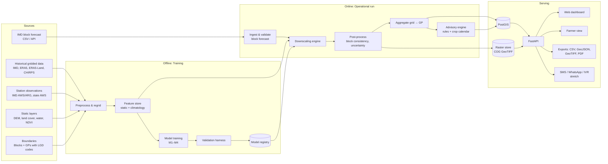
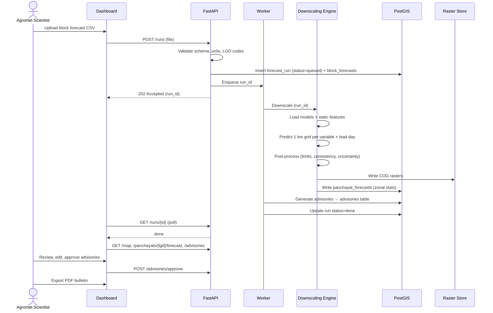
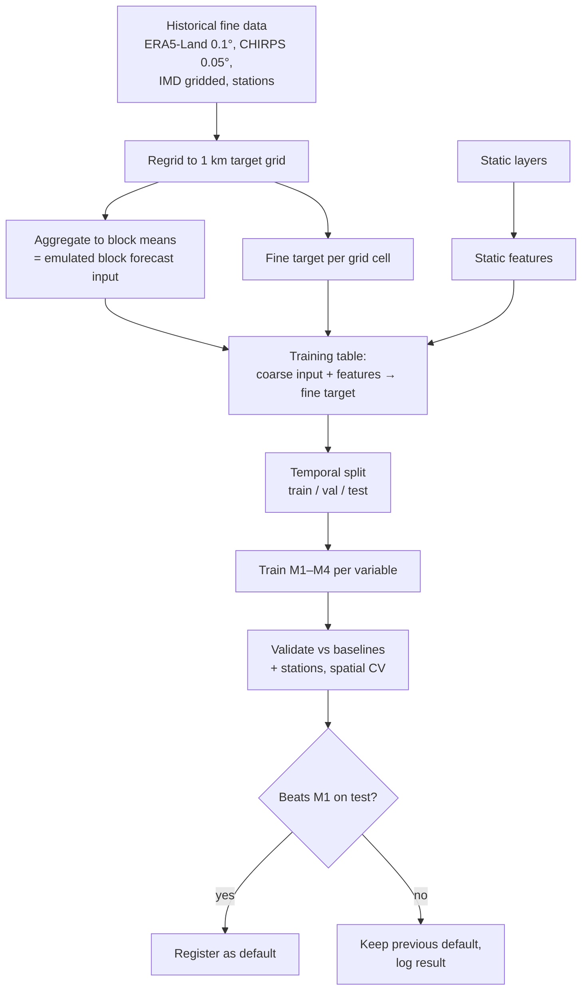
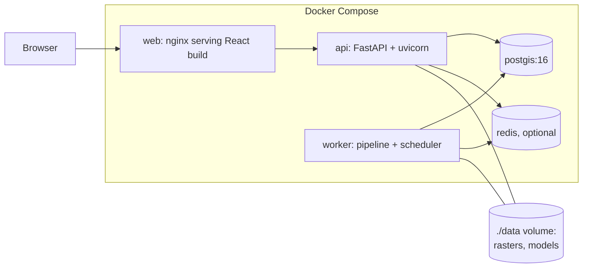

# SYSTEM_ARCHITECTURE.md

**Version:** 0.1 · **Date:** 2026-09-26

---

## 1. Overview

PanchayatCast has two paths:

1. **Offline (training) path.** Learn how weather varies inside blocks, using years of historical coarse and fine data plus static terrain and land layers. Runs once, then gets retrained periodically.
2. **Online (operational) path.** Each time a block forecast is issued, apply the trained models to produce panchayat forecasts and advisories, then serve them as maps, data and text.

---

## 2. Components

| # | Component | Responsibility | Tech |
|---|---|---|---|
| C1 | **Ingest** | Download/load historical data, static layers, boundaries, block forecasts; validate schema and units | Python, cdsapi, imdlib, requests |
| C2 | **Preprocess** | Clip to region, reproject, regrid to the 1 km target grid, build block-mean (coarse) fields | xarray, rioxarray, rasterio, xESMF (optional) |
| C3 | **Feature store** | Static features per grid cell (elevation, slope, land cover…) and fine/coarse climatology ratios | Zarr / NetCDF + Parquet |
| C4 | **Training** | Train models M1–M4 per variable | scikit-learn, LightGBM, PyTorch |
| C5 | **Validation harness** | Metrics vs. stations and fine grids, baseline comparisons, reports | pandas, numpy, matplotlib |
| C6 | **Model registry** | Versioned model files + metadata (data range, metrics, config hash) | Filesystem (`models/`) + JSON manifest; MLflow optional |
| C7 | **Downscaling engine** | Block forecast → 1 km grid forecast per variable and lead day | Python package |
| C8 | **Post-processor** | Physical limits, block consistency, uncertainty bands, wind u/v → speed/dir | Python |
| C9 | **Aggregator** | Grid → panchayat values via area-weighted zonal statistics | exactextract / rasterstats |
| C10 | **Advisory engine** | YAML rules × crop calendar × forecast → advisories with severity; translation | Python, YAML; LLM/MT for wording (optional) |
| C11 | **Database** | Boundaries, forecasts, advisories, runs, metrics | PostgreSQL + PostGIS |
| C12 | **Raster store** | Gridded outputs as Cloud-Optimized GeoTIFFs | Local disk / MinIO (S3-compatible) |
| C13 | **API** | REST endpoints for maps, panchayat data, advisories, exports, uploads | FastAPI |
| C14 | **Worker / scheduler** | Runs forecast jobs (on upload or on schedule), training jobs | APScheduler or Celery + Redis |
| C15 | **Web dashboard** | Scientist/officer UI | React, TypeScript, MapLibre GL |
| C16 | **Farmer view** | Lightweight mobile page | Same React app, separate route (or server-rendered HTML) |
| C17 | **Notifier** (stretch) | SMS/WhatsApp/IVR dispatch | Provider API (TBD) |

---

## 3. Operational run: sequence

**Trigger options:**
- Manual upload (demo default)
- Scheduled pull if an IMD feed or API is provided (current AAS bulletins go out twice weekly, Tue/Fri; confirm)
- Emulated mode: scheduled GFS download → block means → downscale

---

## 4. Training pipeline

Key idea: **block forecasts in production are block averages**, so during training we build the input the same way, by averaging historical fields over block polygons. That keeps the model's input consistent between training and deployment.

---

## 5. Deployment

### 5.1 Hackathon / demo (single machine)

- Everything runs on one laptop. Demo data and models are pre-computed so the demo works **offline** too.

### 5.2 Production (target, for scalability discussion)
- Stateless API behind a load balancer; horizontal scaling.
- Workers parallelised **per state or district** (embarrassingly parallel).
- Managed PostGIS; object storage for rasters; CDN for vector tiles.
- Could run on IMD/NIC/MeitY cloud infrastructure.
- Rough scale: ~2.5 lakh GPs × 8 variables × 5 days is about 10 million values per run, which is small for a database. The 1 km grid for India is about 3.3 million cells × 8 × 5, which one mid-size server handles in minutes with LightGBM inference.

---

## 6. Cross-cutting concerns

| Concern | Approach |
|---|---|
| **Reproducibility** | Config files + data manifest (source, version, checksum) + model metadata per run |
| **Traceability** | Each panchayat value links to run_id, model_version and input block forecast; each advisory links to rule_id |
| **Failure handling** | If the ML model fails for a variable → fall back to M2/M1 and flag it in the output |
| **Data quality** | Range checks, spike detection on inputs; station QC (IMD flags, outlier removal) |
| **Security** | Upload endpoints behind login (scientist role); read-only public farmer endpoints; no personal data stored |
| **Observability** | Structured logs, run durations, per-run metric summary |
| **Offline demo** | Pre-built database dump + rasters; no internet required during the pitch |

---

## 7. Interfaces between modules

| From → To | Contract |
|---|---|
| Ingest → Preprocess | NetCDF/GeoTIFF files in `data/raw/` + `manifest.json` |
| Preprocess → Training | Zarr dataset on the 1 km grid: dims `(time, y, x)`, variables per CLAUDE.md naming |
| Training → Registry | `models/{variable}/{model}/{version}/model.bin + meta.json` |
| Engine → Aggregator | xarray Dataset `(lead_day, y, x)` per variable, plus `p10`, `p90` |
| Aggregator → DB | Rows in `panchayat_forecasts` (see TECHNICAL.md §6) |
| DB → API → UI | JSON / GeoJSON (see TECHNICAL.md §7) |
